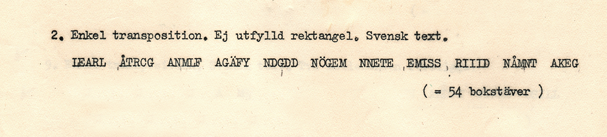

# Försommarpyssel

Min lösning till FRA:s försommarpyssel.

## Uppgiften

> # Försommarpyssel – nya chanser att vinna FRA-muggar
>
> Vi fortsätter med övningsexempel från kryptokursen 1941. Här kommer nästa
> uppgift, lite svårare än den förra. De tre första rätta lösningarna vinner
> varsin FRA-mugg, sedan lottar vi ut tre FRA-muggar bland övriga rätta svar.
>
> 
>
> Observera att det kan vara svårt att skilja på L och I i kryptotexten, därför
> kommer den korrekta kryptotexten här:
>
> > LEARLÅTRCGANMLFAGÄFYNDGDDNÖGEMNNETEEMISSRIIIDNÅMNTAKEG
>
> Om du lyckas lösa kryptot, skicka klartexten och en kort beskrivning hur du
> gjorde till [pysselsvar@fra.se](mailto:pysselsvar@fra.se) senast den 4 juli 2021.
>
> Vinnarna meddelas efter 4 juli 2021.

[Länk](https://fra.se/nyheter/nyheter/nyhetsarkiv/news/forsommarpysselnyachanserattvinnaframuggar.5.4a54ff3617985e0e305ab.html)

## Programmet

Alla subkommandon tar kryptot och bredden på transpositionsrutan som första
respektive andra argument.

### Interaktiv

Om du vill leka med transpositionsrutan (arrangera om kolumnerna) själv kan du
testa följande kommando:

```sh
dotnet run -- interactive "LEARLÅTRCGANMLFAGÄFYNDGDDNÖGEMNNETEEMISSRIIIDNÅMNTAKEG" 7
```

### Troligast

Enklaste sättet att få ut lösningen är att låta programmet sortera alla möjliga
lösningar (för en given bredd) efter hur likt det är svenska enligt
bigramstatestik:

```sh
dotnet run -- likeliest "LEARLÅTRCGANMLFAGÄFYNDGDDNÖGEMNNETEEMISSRIIIDNÅMNTAKEG" 7 SWE
```
